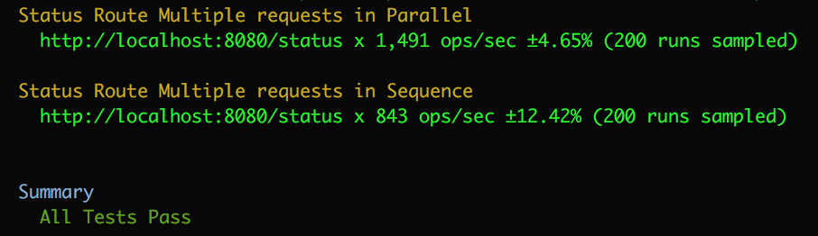
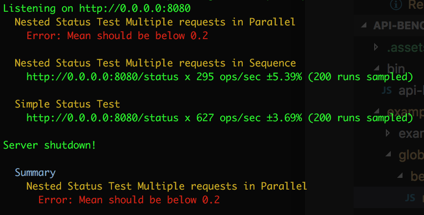

# api-bench-runner

This is a CLI tool which can be used to run [api-benchmark](https://www.npmjs.com/package/api-benchmark) tests. Its interface is inspired by [mocha](https://www.npmjs.com/package/mocha).

## Usage

The idea behind this tool is to allow you to define tests in one or across multiple scripts using _easy_ to use hooks much like `mocha`.

### Example of a Test file

```js
'use strict';

suite('Status Route', () => {
  service('my-service', 'http://localhost:8080');

  suite('Multiple requests in Parallel', () => {
    options({
      runMode: 'parallel',
      minSamples: 200,
      maxTime: 20,
    });

    route('status', {
      method: 'get',
      route: 'status',
      expectedStatusCode: 200,
      maxMean: 0.2, // 200ms
    });
  });

  suite('Multiple requests in Sequence', () => {
    options({
      runMode: 'sequence',
      minSamples: 200,
      maxTime: 20,
    });

    route('status', {
      method: 'get',
      route: 'status',
      expectedStatusCode: 200,
      maxMean: 0.2, // 200ms
    });
  });
});
```

In the above example we use the `suite` hook to define a test suite. This suite will result in a single `api-benchmark` test run. The `suite` hook takes a name (just for the output) and a callback function that will be executed to configure the suite. The callback will include the other hooks which lets you define the service, routes, and options.

You can have multiple test files which `api-bench-runner` will aggregate together allowing you to keep you test code clear and module.

By convention `api-bench-runner` will look for tests under the `bench` folder.

```
├── bench
│   ├── nested-test-example.js
│   └── simple-test-example.js
└── lib
    └── server.js
```

### Example of Command

```
> node_modules/.bin/api-bench-runner .
```

This command will look for all the tests under the `bench` folder and run them displaying the results in the terminal.

You can redirect `api-bench-runner` to a different location if you choose not to put your tests under a `bench` folder.

```
> node_modules/.bin/api-bench-runner ./benchmark
```

You can use _glob_ patterns to find test files as well

```
> node_modules/.bin/api-bench-runner ./test/**/*.bench.js
```

## Output

The output of the tool will be a print out to the terminal showing the test results. When all tests pass (or you did not define restrictions which would cause failures) you will see each test (grouped by test suite) listing info such as operations per second and a summary saying everything passed.



If however you do have restrictions and the route did not meet them or something else went wrong you will see that test run listed with an error and a summary of all test failures printed out at the bottom.



## Reporters

You can specify different reporters for `api-bench-runner` to use depending on what kind of output you need. To pick a reporter use the `--reporter` flag.

### Terminal
By default it will [print to the terminal](#output) but you can make this explicit by setting the `--reporter` flag to `stdterm` or `default`

```
> node_modules/.bin/api-bench-runner ./test/**/*.bench.js --reporter default
```

### HTML

You can have `api-bench-runner` generate an HTML report. The report generated is the report generated by [api-benchmark](https://www.npmjs.com/package/api-benchmark#gethtmlresults-callback). To pick the HTML reporter set the `--reporter` flag to `html`.

```
> node_modules/.bin/api-bench-runner ./test/**/*.bench.js --reporter html
```

By default the HTML report will be generated in the working directory that `api-bench-runner` is in and will save it to the file `benchmarks.js`. To specify a different file name you can use the `--out` flag.

```
> node_modules/.bin/api-bench-runner ./test/**/*.bench.js --reporter html --out my-results.html
```
*Note* The `--out` flag has no effect on `stdterm` reporter and right now is only used by the `html` reporter.

### Multiple Reporters

If you would like to see the results in the terminal _and_ get a HTML report generated you can specify both reporters via the `--reporter` flag.

```
> node_modules/.bin/api-bench-runner ./test/**/*.bench.js --reporter stdterm,html
```

## Hooks

### Define a Suite

You can define a test suite via the `suite` hook.

A _suite_ equates to a single `api-benchmark` test run. The `suite` hook takes two parameters: a title (just for the output) and a callback function for configuring the suite. The callback will include all the other hooks which lets you configure this suite's services, routes, and options.

```js
suite('My suite that tests the status route', () => {
  // Configure the suite here
});
```

You can nest suites inside each other for cases where you have shared configurations.

```js
suite('My suite that tests my-service', () => {
  service('my-service', 'http://localhost:8080'); // All child suites use this same service.

  suite('My suite that tests the status route', () => {
    options(...);
    route(...);
  });

  suite('My suite that tests the version route', () => {
    options(...);
    route(...);
  });
});
```

Both the version and status suites since they don't define a service of their own will check there parent to find out what service to run the tests against. Nesting suites allows for sharable configurations.

## Defining the Service

The tests defined in the suite need to run against a running HTTP server, you can tell the suite where to find the server via the `service` hook.

```js
suite('My suite that tests my-service', () => {
  service('my-service', 'http://localhost:8080');

  options(...);
  route(...);
});
```

The `service` hook takes two parameters: a name (must be a valid ECMAScript object property name) and the URL to the service to run the tests against. The URL is to be the base URL which we can extend with the route paths.

If your hitting a development lap or production environment or a local environment you've manually started up then you can just put in the URL as a string as seen above; however, if the site is dynamic and needs to be brought up when the tests starts and thus might have a dynamic URL (random port?) you can pass in a callback function which will be called by the suite when it starts executing.

```js
function findService() {...}
suite('My suite that tests my-service', () => {
  service('my-service', findService);

  options(...);
  route(...);
});
```

The function you pass in must return a string consisting of the service URL.

## Define Suite Options

Each suite can be configured with options defining how the test should be run. This includes how many samples, if the tests should be parallel or sequential, and the maximum number of concurrent requests if tests are to be done in parallel.

You can define these options via the `options` hook. This hook is optional however as each option has a default value.

```js
suite('Multiple requests in Sequence', () => {
    options({
      runMode: 'sequence',
      minSamples: 200,
      maxTime: 20,
    });

    route(...);
  });
```

These options can also be nested in a parent suite if they are common.
```js
suite('My suite that tests my-service', () => {
  // All child suites use this same service and test options.
  service('my-service', 'http://localhost:8080');
  options({
    runMode: 'sequence',
    minSamples: 200,
    maxTime: 20,
  });

  suite('My suite that tests the status route', () => {
    route(...);
  });

  suite('My suite that tests the version route', () => {
    route(...);
  });
});
```

These options are the `api-benchmark` options, for a list of valid options see [the `api-benchmark` documentation](https://www.npmjs.com/package/api-benchmark#options-object)

## Defining a Route

To define a given test for the suite you need to define the route to test. This can be done via the `route` hook.

The `route` hook takes two parameters: A name (must be a valid ECMAScript object property name) and the relative route path.

```js
suite('My suite that tests the status route', () => {
  service('my-service', 'http://localhost:8080');
  route('status', 'api/status');
});
```

This will tell `api-benchmark` to run the tests per the suite options against the route `api/status` attached to the service (i.e. `http//localhost:8080/api/status`).

By default this will be a `GET` and will always _pass_ displaying the operation per second results; however, if you want to benchmark a different HTTP verb (i.e. `POST`, `PUT`, `DELETE`) or want to define failure conditions (must be faster then Xms, must return with 200) you can pass in a _route options_ object instead of the route string.

```js
suite('My suite that tests the status route', () => {
  route('status', {
      method: 'get',
      route: 'api/status',
      expectedStatusCode: 200,
      maxMean: 0.2, // 200ms
  });
});
```

These options are the `api-benchmark` route options, for a list of valid options see [the `api-benchmark` documentation](https://www.npmjs.com/package/api-benchmark#route-object)


## Setting up a Suite

When running the tests you might need to setup the environment first. You might need to insert entries into the database if testing a `DELETE` route or create users to log in as, you might even just simply need to bring up the server if testing locally. Like `mocha` these setup/tear down steps can be handled via `before` and `after` hooks.

```js
suite('Multiple requests in Sequence', () => {
  before(() => {
    // do Setup
  });

  after(() => {
    // do tear down
  });

  service('my-service', 'http://localhost:8080');
  options(...);
  route(...);
});
```

A suite can also have multiple `before`/`after` hooks which will be executed in the order that they are defined in the suite.

```js
suite('Multiple requests in Sequence', () => {
  before(() => {...}); // runs first
  before(() => {...}); // runs second
  before(() => {...}); // runs last

  after(() => {...}); // runs first
  after(() => {...}); // runs last

  service('my-service', 'http://localhost:8080');
  options(...);
  route(...);
});
```

These `before` and `after` hooks can be on each suite when suits are nested. These hooks will only be run once and will be run in descending order (parent suite hooks are run first followed by children).

```js
suite('Status Route', () => {
  service('my-service', 'http://localhost:8080');
  before(() => {...});
  after(() => {...});

  suite('Multiple requests in Parallel', () => {
    before(() => {...});
    after(() => {...});
    options(...);
    route(...);
  });

  suite('Multiple requests in Sequence', () => {
    before(() => {...});
    after(() => {...});
    options(...);
    route(...);
  });
});
```

In the above when the parallel suite begins first it will trigger its parents `before` hooks then its own followed by the test then its `after` hooks. Next the sequential test will start, as its parents `before` hook have already run they will be skipped so it then runs its `before` hooks followed by the test and ending with its `after` hooks. Since there are no more sibling suites the parent suite's `after` hooks will now be triggered. This is not unlike `mocha`.

### Async Setup

The `before` and `after` hooks take only one parameter and that is the callback function to execute when the hook is triggered. This callback function is run synchronously; however, if it returns a `Promise` the execution will wait until the promise is resolved. Alternatively the passed in function can accept a `done` callback so that it can tell the `before`/`after` hook when its finished.

```js
suite('Multiple requests in Sequence', () => {
  let server;

  before((done) => {
    server = require(`server`);
    server.once('listening', () => {
      done();
    });
  });

  after((done) => {
    server.close((err) => {
      if (err) {
        console.log('Error shutting down server');
      } else {
        console.log('Server shutdown');
      }
      done();
    });
  });

  service('my-service', () => server.url);
  options(...);
  route(...);
});
```

## Global Setup

If you have tests across a number of files having each file bring up and tear down your service is going to be a pain. If you need to bring up your service once at the beginning and only tear it down at the very end of the test run you can define a _global setup script_.

By convention `api-bench-runner` will look for a special script called `setup.js` which contains a single `suite` with `before` and `after` hooks that it will use as the _grandparent_ suite for all the files. That means that any `before` hooks defined in this file will be triggered once at the start of the entire test run and any `after` hooks will be triggered right before the tool finishes allowing for a one time global setup and tear down steps.

The `setup.js` file is expected to live under the `bench` folder of the working directory which the `api-bench-runner` tool is running.

```
├── bench
│   ├── nested-test-example.js
│   ├── setup.js
│   └── simple-test-example.js
└── lib
    └── server.js
```

If you run `api-bench-runner` in the project root it will looks for `bench/setup.js` and add it as the root suite for all the defined tests. If it is not found then no global setup/tear down hooks will be setup.

### Troubleshooting

If your tests are not running correctly and you suspect there is something wrong with the hooks (_did the service come up?_) or otherwise just want to see more info on what is going on there are two options:

#### Turn on API-Benchmark Debug mode

Each `route` can be run in debug mode which simply displays more info to the terminal. If everything is working you just get pretty much the same output as what `api-bench-runner` generates but on error you'll get more info.

```js
suite('My suite that tests the status route', () => {
  route('status', {
    debug: true,
    method: 'get',
    route: 'api/status',
    expectedStatusCode: 200,
    maxMean: 0.2, // 200ms
  });
});
```

#### Turn on logging

The `api-bench-runner` tool has logging although it does not log anything by default. The log messages are printed to the terminal so by default we log nothing to keep the terminal output clean. To see additional logging you can set the log level to `debug` or `tace` via the `--level` flag.

```
> node_modules/.bin/api-bench-runner --level debug .
```

This will print out information about each stage of the tool; that is when it starts executing hooks or starts the test runs.

## Development

### Running Tests

To run the tests for `api-bench-runner` use the `npm test` command.
Make sure to run `npm install` first.

You can have the tests watch for changes and re-run automatically by using the command `npm run watch`.

### Style Guide

The [Airbnb JavaScript Style Guide](https://github.com/airbnb/javascript) is used for this project so you must comply to that rule set. You can verify your changes are in compliance via the `npm run lint` command.

This project does have a few alterations to the rules such as requiring the use of the `use strict` pragma as we don't use `babel`. The `npm run lint` command enforces the alterations. To see all alterations look in the `.eslintrc.json` files.

### Contributing

Bug reports and pull requests are welcome. This project is intended to be a safe, welcoming space for collaboration, and contributors are expected to adhere to the [Contributor Covenant](https://contributor-covenant.org/) code of conduct.

## License

The tool is available as open source under the terms of the [MIT License](https://choosealicense.com/licenses/mit/).